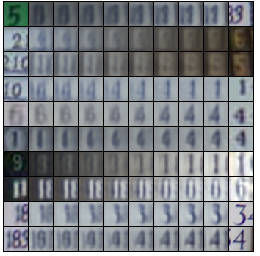
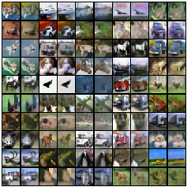

# Various Latent Variable Models
Various Latent Variable Models implementations in Pytorch, including VAE, VAE with AF Prior, VQ-VAE and VQ-VAE with Gated PixelCNN

## Datasets

Datasets (231 MB) can be downloaded [here](https://henrhoi.s3.us-east-2.amazonaws.com/data.zip), and contains CIFAR-10, MNIST and The Street View House Numbers (SVHN) dataset.

| Full Covariance Gaussian | Full Covariance Gaussian 2  | CIFAR-10 | SVHN |
|------|---------|---------|---------|
| | | | |

## Models

**VAE on 2D Data:**

Implemented is a VAE with the following characteristics:

* 2D latent variables $z$ with a standard normal prior, $p(z) = N(0, I)$
* An approximate posterior $q_\theta(z|x) = N(z; \mu_\theta(x), \Sigma_\theta(x))$, where $\mu_\theta(x)$ is the mean vector, and $\Sigma_\theta(x)$ is a diagonal covariance matrix
* A decoder $p(x|z) = N(x; \mu_\phi(z), \Sigma_\phi(z))$, where $\mu_\phi(z)$ is the mean vector, and $\Sigma_\phi(z)$ is a diagonal covariance matrix

**VAE for images:**

Implemented is a standard VAE with the following characteristics:

*   16-dim latent variables $z$ with standard normal prior $p(z) = N(0,I)$
*   An approximate posterior $q_\theta(z|x) = N(z; \mu_\theta(x), \Sigma_\theta(x))$, where $\mu_\theta(x)$ is the mean vector, and $\Sigma_\theta(x)$ is a diagonal covariance matrix
*   A decoder $p(x|z) = N(x; \mu_\phi(z), I)$, where $\mu_\phi(z)$ is the mean vector. (We are not learning the covariance of the decoder)

**VAE with Autoregressive Flow prior - VLAE:**
implement a VAE with an Autoregressive Flow prior ([Variational Lossy Autoencoder (VLAE)](https://arxiv.org/abs/1611.02731)) with the following characteristics:

*   16-dim latent variables $z$ with a MADE prior, with $\epsilon \sim N(0, I)$
*   An approximate posterior $q_\theta(z|x) = N(z; \mu_\theta(x), \Sigma_\theta(x))$, where $\mu_\theta(x)$ is the mean vector, and $\Sigma_\theta(x)$ is a diagonal covariance matrix
*   A decoder $p(x|z) = N(x; \mu_\phi(z), I)$, where $\mu_\phi(z)$ is the mean vector. (We are not learning the covariance of the decoder)

For the MADE prior, it would suffice to use two hidden layers of size $512$. More explicitly, the MADE AF (mapping from $z\rightarrow \epsilon$) should output location $\mu_\theta(z)$ and scale parameters $\sigma_\theta(z)$ and do the following transformation on $z$:
$$\epsilon = z \odot \sigma_\theta(z) + \mu_\theta(z)$$

where the $i$th element of $\sigma_\theta(z)$ is computed from $z_{1:i-1}$ (same for $\mu_\theta(z)$) and optimize the objective

$$-E_{z\sim q(z|x)}[\log{p(x|z)}] + E_{z\sim q(z|x)}[\log{q(z|x)} - \log{p(z)}]$$
where $$\log{p(z)} = \log{p(\epsilon)} + \log{\det\left|\frac{d\epsilon}{dz}\right|}$$

**VQ-VAE:**

Implemented is a [VQ-VAE](https://arxiv.org/abs/1711.00937) on the CIFAR-10 and SVHN. You may find [Lilian Weng's blogpost](https://lilianweng.github.io/lil-log/2018/08/12/from-autoencoder-to-beta-vae.html#vq-vae-and-vq-vae-2) to be useful, to understand this architecture.

Notes:

*   Using a codebook with $K = 128$ latents each with a $D = 256$ dimensional embedding vector
*   Each element in your $K\times D$ codebook should be initialized to be uniformly random in $[-1/K, 1/K]$
*   Use batch size 128 with a learning rate of $10^{-3}$ and an Adam optimizer
*   Center and scale the images to $[-1, 1]$
*   Supposing that $z_e(x)$ is the encoder output, and $z_q(x)$ is the quantized output using the codebook, a straight-through estimator is implemented as follows (where below is fed into the decoder): 
  * `(z_q(x) - z_e(x)).detach() + z_e(x)`

In addition to training the VQ-VAE, we will also need to train a PixelCNN prior on the categorical latents in order to sample:

*   Since the input is a 2D grid of discrete values, we should have an input (learned) embedding layer to map the discrete values to embeddings of length $64$
*   Use a single Type A masked convolutions followed by 10-15 residual blocks, and $2$ $1\times 1$ convolutions of $512$ and $K$ channels respectively.

## Results and samples

| Model | Dataset | Samples |  Samples with decoder noise | 
|------|---------|:---------:|:---------:|
| VAE 2D | Full Covariance Gaussian | |  |
| VAE 2D | Full Covariance Gaussian 2 |    |  |

| Model | Dataset | Samples |  Interpolations | Reconstructions |
|------|---------|:---------:|:---------:|:---------:|
| VAE | CIFAR-10 | |  |  |
| VAE | SVHN | |  |  |
| VLAE | CIFAR-10 | |  |  |
| VLAE | SVHN | |  |  |

| Model | Dataset | Samples  | Reconstructions |
|------|---------|:---------:|:---------:|
| VQ-VAE | CIFAR-10 | |  |
| VQ-VAE | SVHN | |  |
| VQ-VAE with Gated PixelCNN prior| CIFAR-10 | |  |
